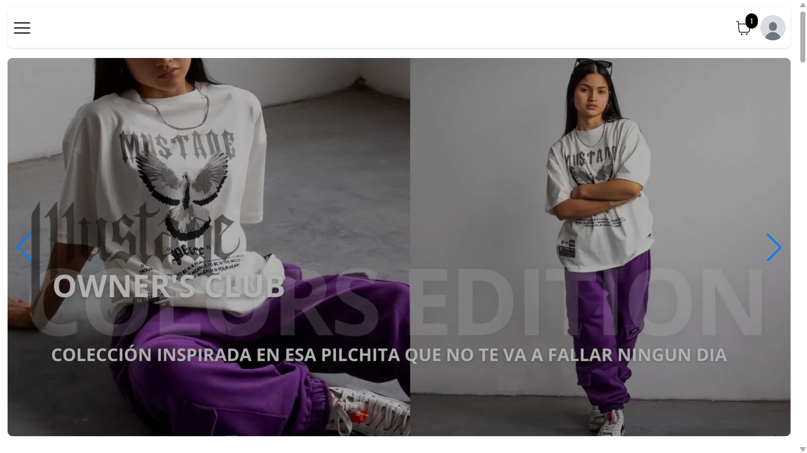
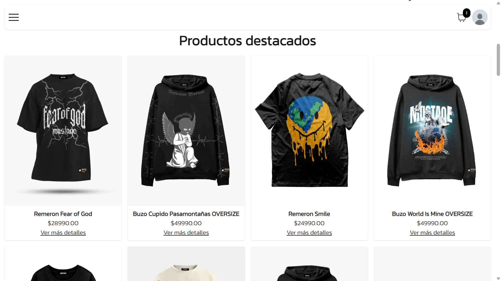
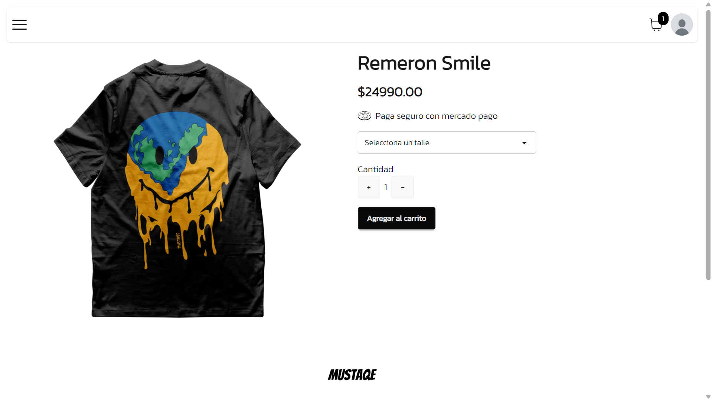

# Ecommerce online - Mustaqe

## Características principales:

- Carrito integrado
- Filtro de productos por categoria
- Pasarela de pago
- Integración con mercado pago para pagos online
- Autenticación de usuarios
- Diseño minimalista y moderno

## Herramientas utilizadas:

- Nextjs 16.1.0
- Better auth
- Mercado pago
- Zustand
- Postgresql
- Tailwind css
